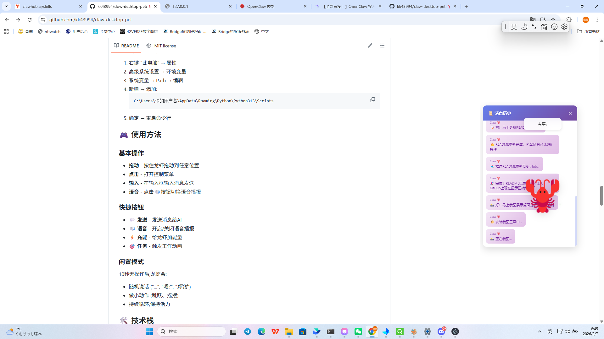

# 🦞 Claw Desktop Pet

<div align="center">


**一个企业级7×24稳定运行的桌面龙虾智能助手**

集成了 OpenClaw AI、智能语音播报、性能监控、自动恢复等强大功能

[快速开始](#-快速开始) • [功能特性](#-v130-新特性) • [文档](#-文档) • [更新日志](#-更新日志)

</div>

---

## 📸 预览

<div align="center">



*桌面龙虾正在工作中 🦞*

</div>

---

## ✨ 核心亮点

<table>
<tr>
<td width="50%">

### 🛡️ 系统级容错
- 5种错误全捕获
- 智能自愈机制
- 致命错误识别
- 完整错误统计

</td>
<td width="50%">

### 🔄 自动重启
- 崩溃后自动恢复
- 渐进式延迟
- 崩溃循环保护
- 状态持久化

</td>
</tr>
<tr>
<td width="50%">

### 📊 性能监控
- 实时健康评分
- 异常告警
- 性能报告生成
- CPU/内存监控

</td>
<td width="50%">

### 🎙️ 智能语音
- 自然口语化
- 情境化播报
- 优先级队列
- 智能过滤

</td>
</tr>
<tr>
<td width="50%">

### 📝 日志管理
- 自动轮转
- 空间管理
- 日志浏览
- 完整可观测

</td>
<td width="50%">

### 🧹 资源优化
- 自动清理缓存
- 定时执行
- 语音播报结果
- 完整统计

</td>
</tr>
</table>

---

## 🚀 系统架构

```
┌─────────────────────────────────────────────────────────┐
│                   🦞 桌面龙虾 v1.3.0                      │
├────────────���────────────────────────────────────────────┤
│                                                          │
│  ┌──────────────┐  ┌──────────────┐  ┌──────────────┐  │
│  │ 🛡️ 错误处理   │  │ 🔄 自动重启  │  │ 📊 性能监控   │  │
│  │              │  │              │  │              │  │
│  │ • 5种捕获    │  │ • 智能恢复  │  │ • 健康评分   │  │
│  │ • 自动恢复   │  │ • 渐进延迟  │  │ • 异常告警   │  │
│  │ • 错误统计   │  │ • 崩溃保护  │  │ • 报告生成   │  │
│  └──────────────┘  └──────────────┘  └──────────────┘  │
│                                                          │
│  ┌──────────────┐  ┌──────────────┐  ┌──────────────┐  │
│  │ 🎙️ 智能语音   │  │ 📝 日志管理  │  │ 🧹 资源优化   │  │
│  │              │  │              │  │              │  │
│  │ • 口语化     │  │ • 自动轮转  │  │ • 缓存清理   │  │
│  │ • 情境播报   │  │ • 空间管理  │  │ • 定时执行   │  │
│  │ • 优先队列   │  │ • 日志浏览  │  │ • 统计报告   │  │
│  └──────────────┘  └──────────────┘  └──────────────┘  │
│                                                          │
├─────────────────────────────────────────────────────────┤
│              ⚡ OpenClaw AI • 🎨 Electron                │
└─────────────────────────────────────────────────────────┘
```

---

## ⚡ 快速开始

### 最简安装 (3步)

```bash
# 1️⃣ 克隆项目
git clone https://github.com/kk43994/claw-desktop-pet.git
cd claw-desktop-pet

# 2️⃣ 安装依赖
npm install
pip install edge-tts

# 3️⃣ 启动
npm start
```

### 完整功能 (含AI)

```bash
# 1-2步同上

# 3️⃣ 安装 OpenClaw
npm install -g openclaw

# 4️⃣ 启动 Gateway
openclaw gateway start

# 5️⃣ 启动龙虾
npm start
```

**✨ 首次启动:**
- 🦞 龙虾出现在右下角
- 🛡️ 全局错误处理启动
- 📊 性能监控开始采样
- 🎙️ 智能语音系统就绪

---

## 🚀 v1.3.0 新特性

### 🛡️ 7×24稳定运行系统

<details>
<summary><b>全局错误处理</b> - 点击展开</summary>

- ✅ 5种错误类型全捕获
  - `uncaughtException` - 未捕获异常
  - `unhandledRejection` - Promise 拒绝
  - `warning` - 系统警告
  - `multipleResolves` - 多次 resolve
  - `beforeExit` - 进程退出前
- ✅ 智能恢复机制 (最多3次尝试)
- ✅ 致命错误识别 (ENOSPC, ENOMEM等)
- ✅ 完整错误统计和历史

📖 [详细文档](ERROR-HANDLING.md)

</details>

<details>
<summary><b>自动重启机制</b> - 点击展开</summary>

- ✅ 崩溃后自动恢复
- ✅ 渐进式延迟 (3秒→60秒)
- ✅ 崩溃循环保护
- ✅ 状态持久化
- ✅ 重启次数限制 (1小时10次)

📖 [详细文档](AUTO-RESTART.md)

</details>

<details>
<summary><b>性能监控系统</b> - 点击展开</summary>

- ✅ 实时性能采集 (CPU、内存、系统资源)
- ✅ 智能健康评分 (100分制)
- ✅ 异常检测和告警
- ✅ 错误统计和持久化
- ✅ 性能报告生成

📖 [详细文档](MONITORING.md)

</details>

<details>
<summary><b>日志轮转管理</b> - 点击展开</summary>

- ✅ 自动清理过期日志 (30天)
- ✅ 大文件自动归档 (10MB)
- ✅ 日志浏览和查询
- ✅ 空间统计分析

</details>

<details>
<summary><b>缓存清理系统</b> - 点击展开</summary>

- ✅ 自动清理截图、语音、日志
- ✅ 定时执行 (6小时)
- ✅ 语音播报清理结果
- ✅ 完整统计

📖 [详细文档](CACHE-CLEANUP.md)

</details>

### 🎙️ 智能语音系统

<details>
<summary><b>智能播报</b> - 点击展开</summary>

**智能内容分析**
- 自动分类: success, error, warning, data, celebration
- 优先级识别: high, medium, normal, low
- 情境检测: happy, urgent, calm, excited

**口语化处理**
- 技术术语转换 (API→接口, JSON→数据)
- 数字读法优化 (100MB→100兆)
- 自然停顿添加
- 连接词补充

**情境化播报**
- 紧急消息: 换男声 + 语速+10%
- 兴奋消息: 语速+20% + 音调+50Hz
- 成功消息: 音调+30Hz
- 重要消息: 优先插队

📖 [详细文档](SMART-VOICE.md)

</details>

**播报效果对比:**

```diff
- 旧版: "清理缓存完成,释放了50.00MB空间"
+ 新版: "清理缓存完成， 释放了50兆字节空间！"
```

---

## 📦 功能特性

### 🎨 核心功能
- ✅ **智能助手** - 企业级7×24稳定运行
- ✅ **AI 对话** - 集成 OpenClaw，实时智能对话
- ✅ **智能语音** - 口语化自然播报，情境化表达
- ✅ **性能监控** - 实时健康评分，异常告警
- ✅ **自动恢复** - 崩溃后智能重启
- ✅ **日志管理** - 自动轮转，完整可观测
- ✅ **双向同步** - 飞书消息 ↔️ 桌面通知

### 🎭 表情系统
- 🦞 正常状态 - 平静待机
- 🤔 思考中 - 处理问题时
- 💼 忙碌中 - 收到消息时
- 🎉 兴奋 - 开心时刻

### 🎬 动画效果
- **呼吸动画** - 默认状态，上下浮动
- **思考动画** - 左右摇头
- **说话动画** - 上下跳动
- **工作动画** - 左右摇摆
- **开心动画** - 旋转庆祝

---

## 📊 性能指标

| 指标 | 数值 | 说明 |
|------|------|------|
| 内存占用 | ~60MB | 含监控数据 |
| CPU占用 | <1% | 正常运行 |
| 启动时间 | ~2秒 | 首次启动 |
| 重启恢复 | <5秒 | 崩溃后恢复 |
| 健康评分 | 实时 | 100分制 |
| 日志大小 | 自动控制 | 30天轮转 |

---

## 🔍 监控和调试

### IPC 接口示例

```javascript
// 性能监控
const stats = await window.ipc.invoke('performance-stats');
const health = await window.ipc.invoke('health-check');

// 日志管理
const logs = await window.ipc.invoke('log-list', 10);
await window.ipc.invoke('log-rotate');

// 错误历史
const errors = await window.ipc.invoke('error-history', 10);

// 智能语音
await window.ipc.invoke('voice-speak', '测试', { priority: 'high' });
const voiceStats = await window.ipc.invoke('voice-stats');
```

---

## 🛠️ 技术栈

<div align="center">

| 技术 | 用途 |
|------|------|
| **Electron** | 桌面应用框架 |
| **OpenClaw** | AI 对话引擎 |
| **Edge TTS** | 微软语音合成 |
| **Node.js** | 后端运行时 |
| **HTML/CSS/JS** | 前端界面 |

</div>

---

## 📝 更新日志

### v1.3.0 (2026-02-07) 🚀

<details>
<summary>查看详情</summary>

**新增功能:**
- ✨ 全局错误处理系统
- ✨ 自动重启机���
- ✨ 性能监控系统
- ✨ 日志轮转管理
- ✨ 缓存清理系统
- ✨ 智能语音系统

**技术改进:**
- 📝 新增5份技术文档
- 🧪 新增5个测试脚本
- 🎯 +4558行代码
- 📦 18个文件修改

[查看完整发布说明](RELEASE-v1.3.0.md)

</details>

### v1.1.0 (2026-02-06)
- ✨ 进度汇报系统
- 🎤 emoji 过滤
- 📏 增加语音长度

### v1.0.0 (2026-02-06)
- 🎉 初始发布

---

## 📚 文档

- 📖 [错误处理文档](ERROR-HANDLING.md)
- 📖 [自动重启文档](AUTO-RESTART.md)
- 📖 [性能监控文档](MONITORING.md)
- 📖 [智能语音文档](SMART-VOICE.md)
- 📖 [缓存清理文档](CACHE-CLEANUP.md)
- 📖 [发布说明 v1.3.0](RELEASE-v1.3.0.md)

---

## 🚀 未来计划

- [ ] 快捷键唤起 (Ctrl+Shift+C)
- [ ] 主题切换系统
- [ ] 夜间模式
- [ ] 远程监控面板
- [ ] AI 辅助诊断
- [ ] Windows 服务模式
- [ ] 多语言支持

---

## 📄 许可证

MIT License - 自由使用、修改、分发

---

## 🤝 贡献

欢迎提交 Issue 和 Pull Request!

---

## 👨‍💻 作者

- **zhouk (kk43994)** - 开发者
- **Claw (AI)** - 灵魂设计师 🦞

---

<div align="center">

**⭐ 如果喜欢，请给个 Star���**

**🦞 现在是企业级7×24稳定运行的智能助手！**

Made with ❤️ and 🦞

[⬆ 回到顶部](#-claw-desktop-pet)

</div>
