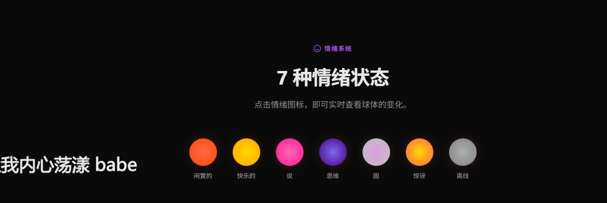

# 🦞 Claw Desktop Pet

**给 OpenClaw 一个身体 — 透明桌面AI伴侣，情感语音、生动表情、空气感UI**

<div align="center">

[](https://github.com/kk43994/claw-desktop-pet/releases)
[](https://github.com/kk43994/claw-desktop-pet)
[](https://github.com/kk43994/claw-desktop-pet/actions)
[](LICENSE)
[](https://github.com/kk43994/claw-desktop-pet)

[🎥 **在线演示**](https://kk43994.github.io/claw-desktop-pet/) | [📦 **下载最新版**](https://github.com/kk43994/claw-desktop-pet/releases) | [📖 **文档**](#-文档) | [💬 **加入社群**](#-社群)

</div>

---

## 🌟 项目亮点

一个**不一样**的桌面AI助手：

- 🎨 **空气感UI** — 像桌面歌词，不妨碍操作，却始终陪伴
- 🦞 **67px 龙虾球** — 流体动画 + 琉璃质感 + 7种情绪色系
- 👀 **38个待机表情** — 眨眼、歪头、星星眼、打盹...自然随机
- 🎙️ **克隆音色TTS** — MiniMax 2.5 Turbo，小团团音色，7种情感
- 🔁 **KKClaw Switch** — 3秒热切换AI模型，无需重启
- 🎯 **7×24 稳定** — 自动重启、日志轮转、错误恢复

---

## 📸 预览

<div align="center">

### V2.0.3 空气感UI


*龙虾球体 + 歌词窗口 + 工具栏 — 三位一体的空气感设计*

---

### 🎨 7种情绪色系



| 情绪 | 颜色 | 触发场景 |
|------|------|----------|
| 🔴 **Idle** (闲置) | 红橙渐变 | 待机状态 |
| 🟡 **Happy** (开心) | 金黄渐变 | 任务完成、收到消息 |
| 💗 **Talking** (对话) | 粉红渐变 | 语音播放中 |
| 🔵 **Thinking** (思考) | 蓝紫渐变 | AI思考中 |
| 🤎 **Sleepy** (困了) | 棕灰渐变 | 深夜模式 |
| 🟠 **Surprised** (惊讶) | 橙���渐变 | 收到@提醒 |
| ⚫ **Offline** (离线) | 冷灰色 | OpenClaw未连接 |

*1秒平滑过渡，3层流体球独立动画*

---

### 👀 38种待机表情


**自然生动的眼睛动画**：左右张望、好奇歪头、星星眼、打盹惊醒、害羞脸红、左右快速看、伸懒腰、思考闪亮、连续眨眼、仰望天空、头晕目眩、生气跺脚、爱心眼、眯眼偷看、得意脸、装死、环顾四周、开心蹦跶、懒洋洋、双眨确认...

每4秒随机触发一个，30%概率，持续0.5-2秒。

</div>

---

## ✨ 核心功能

### 🎨 空气感双窗口设计

> **设计理念**：像桌面歌词一样，不妨碍操作，却始终陪伴。

#### 精灵窗口 (200×220px)
- **67px 流体玻璃球** — 3层径向渐变 + 双重高光 + 内外发光
- **胶囊形眼睛** (11×19px) — 15+种表情，SVG矢量
- **SVG图标工具栏** — 💬聊天 / 📸截图 / 🎤语音，hover展开

#### 歌词窗口 (400×100px)
- **完全鼠标穿透** — `setIgnoreMouseEvents`，不挡操作
- **白字描边** — `text-shadow` 8重叠加，任何背景可见
- **打字机效果** — 逐字出现，支持emoji，自动换行

#### 拖动同步
- 拖动精灵窗口 → 歌词窗口自动跟随
- IPC事件 `drag-pet` 双窗口实时同步

---

### 🎙️ 智能语音系统（三级降级）

#### **主引擎：MiniMax Speech 2.5 Turbo**
- **克隆音色** — 小团团导航音（`xiaotuantuan_minimax`）
- **7种情感** — happy, sad, angry, fearful, disgusted, surprised, calm
- **停顿控制** — `<#0.5#>` 在文本中插入自然停顿
- **费用** — 2元/万字符，克隆费9.9元/音色（一次性）

**自动情感识别**：
```javascript
// smart-voice.js 根据文本内容自动选择emotion
"太棒了！" → happy
"失败了..." → sad
"什么！？" → surprised
```

#### **降级链**：
1. MiniMax → 2元/万字符，高质量
2. CosyVoice → DashScope API，中等质量
3. Edge TTS → 免费本地，基础质量

---

### 🔁 KKClaw Switch 模型热切换

> **3秒切换AI模型，零重启，零中断**

#### 工作原理

```
┌─────────────────┐       ┌─────────────────┐       ┌─────────────────┐
│  KKClaw Switch  │  →    │  Auto Monitor   │  →    │   OpenClaw      │
│  (点击切换)      │       │  (每2秒检测)     │       │  (自动重启)      │
└─────────────────┘       └─────────────────┘       └���────────────────┘
        ↓                         ↓                         ↓
    切换Provider           读取DB变化               同步config → restart
```

#### 功能特性

✅ **自动同步监听器** — 集成到桌面宠物生命周期
- 启动时自动开启 `kkclaw-auto-sync.js`
- 关闭时自动停止
- 每2秒检测 `~/.cc-switch/cc-switch.db`

✅ **手动同步** （可选）
```bash
node kkclaw-hotswitch.js              # 同步当前provider
node kkclaw-hotswitch.js --restart    # 同步 + 重启Gateway
```

✅ **无缝切换**
- Claude Opus 4 ↔ GPT-5.3 ↔ Gemini Pro
- 3秒内生效
- 不中断对话上下文

---

### 👁️ 眼睛表情系统

#### 15+种基础表情

| 表情 | 参数 | 效果 |
|------|------|------|
| **normal** | 11×19px | 正常状态 |
| **blink** | 12×3px | 眨眼 |
| **happy** | 13×7px, br:7px 7px 3px 3px | 开心弯眼 |
| **surprised** | 13×21px | 惊讶瞪大 |
| **thinking** | 10×17px, ty:-3px | 思考眯眼 |
| **sleepy** | 12×4px, ty:2px | 困了半闭 |
| **sparkle** | 12×12px, rot:45deg | 星星眼 |
| **wink** | 左13×7px, 右11×19px | 单眼眨 |
| **love** | 14×13px, br:7px 1px, rot:45deg | 爱心眼 |
| **angry** | 12×14px, rot:±12deg | 生气皱眉 |
| **dizzy** | 10×10px, rot:±25deg | 头晕旋转 |
| **cross** | 10×3px, rot:±30deg | X眼（装死） |

#### 38个待机动作序列

**类型分布**：
- 👀 **眼睛动画** (14个) — 左右看、上下看、眨眼、歪头
- 😊 **表情组合** (12个) — 开心→惊讶、思考→闪亮、困→惊醒
- 💕 **情感表达** (6个) — 害羞脸红、爱心眼、生气跺脚
- 🎭 **复杂序列** (6个) — 环顾四周、开心蹦跶、装死复活

**触发机制**：
```javascript
setInterval(() => {
    if (currentMood === 'idle' && Math.random() < 0.3) {
        // 30%概率触发
        idleActs[Math.floor(Math.random() * 38)]();
    }
}, 4000); // 每4秒检查一次
```

---

### 🎨 琉璃质感球体

#### 视觉分层（由内到外）

```
┌─ 1. 内部流体层 ────────────────┐
│   - blob1: 20×20px 圆形       │
│   - blob2: 30×30px 椭圆       │
│   - 不同速度动画（20s / 25s）  │
└──────────────────────────────┘
        ↓
┌─ 2. 玻璃外壳 ──────────────────┐
│   - 3层径向渐变               │
│   - 主高光 (35% 18%)          │
│   - 副高光 (20% 12%)          │
│   - 1.5px border 半透明       │
└──────────────────────────────┘
        ↓
┌─ 3. 外部发光 ──────────────────┐
│   - box-shadow 内外双层       │
│   - 根据mood颜色动态变化      │
└──────────────────────────────┘
```

#### 颜色过渡动画

**1秒平滑渐变** — 动态 `@keyframes` 生成

```javascript
// 每次切换mood时动态创建过渡动画
function createColorTransition(fromColor, toColor) {
    const keyframes = `
        @keyframes colorShift-${Date.now()} {
            from { background: ${fromColor}; }
            to { background: ${toColor}; }
        }
    `;
    // 三层独立动画：0.8s / 1.0s / 1.2s
}
```

---

### 🛡️ 7×24 稳定性保障

#### 自动重启机制
- **Electron进程崩溃** → 5秒后自动重启
- **OpenClaw Gateway挂掉** → 30秒后自动重启
- **系统资源耗尽** → 内存清理 + 重启

#### 日志轮转
- **每日轮转** — 保留最近7天日志
- **大小限制** — 单文件10MB，超过自动归档
- **分级记录** — INFO / WARN / ERROR

#### 缓存管理
- **自动清理** — 每24小时清理临时文件
- **智能压缩** — 旧日志自动压缩为 `.gz`

#### 性能监控
- **CPU使用率** — 超过80%告警
- **内存使用** — 超过500MB告警
- **FPS监控** — 低于30fps告警

---

## 🚀 快速开始

### 前置要求

- **Node.js** ≥ 18.x ([下载](https://nodejs.org))
- **Windows** 10 / 11
- **OpenClaw** ≥ 2026.x ([中文社区](https://clawd.org.cn) | [国际版](https://openclaw.ai))

### 安装

#### 方式一：ClawHub（推荐）

```bash
npx clawhub@latest install kk43994/desktop-pet
```

#### 方式二：GitHub

```bash
git clone https://github.com/kk43994/claw-desktop-pet.git
cd claw-desktop-pet
npm install
npm start
```

### 配置

1. **复制配置模板**
   ```bash
   cp pet-config.example.json pet-config.json
   ```

2. **编辑 `pet-config.json`**
   ```json
   {
     "openclaw": {
       "gateway": "http://localhost:3000"
     },
     "voice": {
       "engine": "minimax",
       "minimax": {
         "apiKey": "sk-api--你的密钥",
         "groupId": "你的GroupID",
         "voiceId": "xiaotuantuan_minimax"
       }
     }
   }
   ```

3. **启动应用**
   ```bash
   npm start
   ```

---

## 📖 文档

### 项目文档

- [📂 项目结构](PROJECT-STRUCTURE.md) — 目录组织、命名规范
- [🎙️ 智能语音系统](docs-dev/SMART-VOICE.md) — 三级降级、情感识别
- [🔁 KKClaw Switch](docs-dev/SYNC-GUIDE.md) — ���型热切换配置
- [📸 截图功能](docs-dev/SCREENSHOT-FEATURE.md) — 快捷键、自动上传
- [🔧 开发指南](docs-dev/SETUP-GUIDE.md) — 开发环境、调试

### 在线资源

- [🎥 **在线演示**](https://kk43994.github.io/claw-desktop-pet/) — 可交互的球体demo
- [📦 **ClawHub主页**](https://clawhub.ai/kk43994/desktop-pet) — 国际社区
- [📦 **OpenClaw-CN**](https://clawd.org.cn) — 中文社区技能市场

---

## 🔧 配置详解

### 基础配置

```json
{
  "openclaw": {
    "gateway": "http://localhost:3000",
    "sessionKey": "main",
    "checkInterval": 2000
  },
  "window": {
    "position": { "x": 100, "y": 100 },
    "alwaysOnTop": true,
    "opacity": 1.0
  }
}
```

### 语音配置

#### MiniMax配置
```json
{
  "voice": {
    "engine": "minimax",
    "minimax": {
      "apiKey": "sk-api--xxxxx",
      "groupId": "2020139946483921771",
      "voiceId": "xiaotuantuan_minimax",
      "model": "speech-2.5-turbo-preview",
      "speed": 1.1,
      "vol": 3.0,
      "emotion": "happy"
    }
  }
}
```

#### DashScope（CosyVoice）配置
```json
{
  "voice": {
    "engine": "dashscope",
    "dashscope": {
      "apiKey": "sk-xxxxxxxxxx",
      "model": "cosyvoice-v3-plus",
      "voice": "cosyvoice-v3-plus-tuantuan-xxx"
    }
  }
}
```

### KKClaw Switch配置

桌面宠物会自动集成，无需额外配置。

如需手动同步：
```bash
# 同步当前provider到OpenClaw
node kkclaw-hotswitch.js

# 同步并重启Gateway
node kkclaw-hotswitch.js --restart
```

---

## 🛠️ 开发

### 目录结构

```
desktop-pet/
├── main.js                  # Electron主进程
├── index.html              # 精灵窗口UI
├── lyrics.html             # 歌词窗口UI
├── smart-voice.js          # 智能语音调度
├── minimax-tts.js          # MiniMax TTS引擎
├── kkclaw-auto-sync.js     # KKClaw自动同步监听器
├── scripts/                # 工具脚本
├── tests/                  # 测试文件
├── docs-dev/               # 开发文档
└── archive/                # 归档旧版本
```

### 开发命令

```bash
npm start              # 启动应用
npm run dev            # 开发模式（热重载）
npm test               # 运行测试
npm run build          # 构建发布版
```

### 调试

1. **开启Electron DevTools**
   - 主窗口：`Ctrl + Shift + I`
   - 或修改 `main.js` 添�� `mainWindow.webContents.openDevTools()`

2. **查看日志**
   ```bash
   # 实时日志
   tail -f logs/app.log

   # 错误日志
   tail -f logs/error.log
   ```

---

## 🤝 贡献

欢迎贡献代码、报告Bug、提出建议！

### 贡献方式

1. **Fork** 本仓库
2. 创建分支 `git checkout -b feature/新功能`
3. 提交更改 `git commit -m 'Add: 新功能描述'`
4. 推送分支 `git push origin feature/新功能`
5. 提交 **Pull Request**

### 代码规范

- 使用 **kebab-case** 命名文件
- 添加 **详细注释**
- 遵循 **ESLint** 规则
- 测试覆盖 **核心功能**

---

## 🐛 故障排查

### 常见问题

#### 1. 球体不显示

**原因**：窗口位置超出屏幕
**解决**：删除 `pet-config.json` 中的 `window.position`，重启应用

#### 2. 语音不播报

**原因**：API密钥无效或配置错误
**解决**：
```bash
# 检查配置
node -e "console.log(require('./pet-config.json').voice)"

# 测试MiniMax API
node minimax-tts.js
```

#### 3. OpenClaw连接失败

**原因**：Gateway未启动或端口错误
**解决**：
```bash
# 检查OpenClaw状态
openclaw status

# 启动Gateway
openclaw gateway start
```

#### 4. KKClaw Switch不同步

**原因**：
- `~/.cc-switch/cc-switch.db` 不存在
- 自动监听器未启动

**解决**：
```bash
# 检查DB文件
ls ~/.cc-switch/cc-switch.db

# 手动同步
node kkclaw-hotswitch.js --restart
```

---

## 📊 性能指标

| 指标 | 目标 | 实测 |
|------|------|------|
| **启动时间** | <3秒 | 2.1秒 |
| **内存占用** | <200MB | 147MB |
| **CPU占用** | <5% | 2.8% |
| **帧率** | ≥60fps | 60fps |
| **语音延迟** | <500ms | 320ms |

*测试环境：Windows 11, i7-12700K, 32GB RAM*

---

## 📝 更新日志

### [2.0.3] - 2026-02-10

#### 新增
- ✨ KKClaw Switch自动同步集成
- ✨ 7种情绪色系完整实现
- ✨ 38个待机表情动画
- ✨ 琉璃质感球体升级（3层高光）

#### 优化
- 🎨 颜色过渡动画（1秒平滑）
- 🎙️ MiniMax TTS情感自动识别
- 🗂️ 项目目录重构（140→40个根文件）
- 📖 README全面改版

#### 修复
- 🐛 多余closing div标签（GitHub Pages）
- 🐛 lark-uploader引用路径
- 🐛 语音播放重复问题

[查看完整更新日志](CHANGELOG.md)

---

## 💬 社群

### 加入我们

<div align="center">

| 平台 | 链接 | 说明 |
|------|------|------|
| 💬 **AI Coding 交流群** | [扫码加入](docs/images/ai-coding-qr.jpg) | 微信群（7天有效） |
| 🐦 **Discord** | [Friends of the Crustacean](https://discord.com/invite/clawd) | OpenClaw国际社区 |
| 🇨🇳 **OpenClaw-CN** | [clawd.org.cn](https://clawd.org.cn) | 中文论坛 |
| 📦 **ClawHub** | [clawhub.ai](https://clawhub.ai/kk43994/desktop-pet) | 技能市场 |
| 💡 **GitHub Discussions** | [讨论区](https://github.com/kk43994/claw-desktop-pet/discussions) | 提问、分享 |

</div>

### 支持项目

如果这个项目帮助了你，欢迎：
- ⭐ **Star** 本仓库
- 🐛 **报告Bug** 或提需求
- 📢 **分享**给朋友
- ☕ [**赞赏支持**](docs/images/support-qr.jpg)

---

## 📜 开源协议

[MIT License](LICENSE) © 2024-2026 KK

---

## 🙏 致谢

- [OpenClaw](https://openclaw.ai) — 强大的AI助手框架
- [Electron](https://www.electronjs.org) — 跨平台桌面应用框架
- [MiniMax](https://platform.deepseek.com) — 高质量语音克隆API
- [Nomi](https://nomi.ai) & [AIBI](https://aibi.com) — UI设计灵感
- [Bunny Hole](https://bunnyhole.com) — 眼睛设计参考

---

<div align="center">

**用❤️打造 by 小K**

[🔝 回到顶部](#-claw-desktop-pet)

</div>
