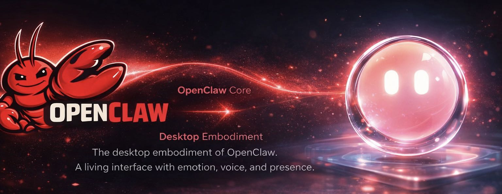

# 🦞 Claw Desktop Pet

<div align="center">



A production-minded, transparent Electron desktop companion for OpenClaw.

一款面向 7×24 稳定运行的透明桌面 AI 伙伴（OpenClaw 的“身体”）。


</div>

---

## Why / Why Now

EN:
- **OpenClaw is powerful, but invisible.** This project gives OpenClaw a *desktop presence*.
- **Built for real usage**, not demos: resilience, observability, log rotation, cache cleanup.

中文：
- **OpenClaw 很强，但“看不见”。** 桌面龙虾把它变成一个“有存在感”的桌面实体。
- **面向真实长期运行**：稳定性、监控、日志轮转、缓存清理都内置。

---

## What You Get

EN:
- A **fluid glass ball** UI (67px) with **micro-expressions** (15+ eye states)
- **Desktop lyrics** style messages (typewriter + glow + mouse click-through)
- **Emotional TTS pipeline**: MiniMax → CosyVoice → Edge TTS (fallback)
- **KKClaw Switch**: provider/model management + one-click sync to OpenClaw
- “Production-minded” reliability: global error hooks, auto restart, health score, logs

中文：
- **流体玻璃球**（67px）+ **15+** 眼睛微表情
- **桌面歌词**消息（打字机 + 自发光 + 鼠标穿透）
- **情绪语音**：MiniMax → CosyVoice → Edge TTS（三级降级）
- **KKClaw Switch**：服务商/模型管理 + 一键同步到 OpenClaw
- 企业级稳定性：全局错误捕获、自动恢复、健康评分、日志/缓存管理

---

## Table of Contents

- [Quick Start](#quick-start)
- [Architecture](#architecture)
- [Configuration](#configuration)
- [KKClaw Switch: Hot Switch & Sync](#kkclaw-switch-hot-switch--sync)
- [Troubleshooting](#troubleshooting)
- [Security & Privacy](#security--privacy)
- [Roadmap](#roadmap)
- [Contributing](#contributing)
- [Release Process](#release-process)
- [Community](#community)
- [Support](#support)

---

## Quick Start

### 1) Install & Run (Minimum)

```bash
git clone https://github.com/kk43994/claw-desktop-pet.git
cd claw-desktop-pet
npm install
npm start
```

### 2) Enable Full Experience (OpenClaw + TTS)

```bash
# Install OpenClaw CLI
npm install -g openclaw

# Start Gateway
openclaw gateway start

# Configure TTS keys
# Copy pet-config.example.json -> pet-config.json and fill in keys

# Run
npm start
```

Notes:
- EN: First launch shows **offline** state. Once connected, it plays a "revive" animation.
- 中文：首次启动默认是 **离线灰色**；连接成功会触发复活动画。

---

## Architecture

```text
┌──────────────────────────────────────────────────────────────────┐
│                    🦞 Claw Desktop Pet (Electron)                 │
├──────────────────────────────────────────────────────────────────┤
│  Windows Desktop (Transparent Always-on-top Windows)              │
│                                                                  │
│  ┌────────────── Sprite Window ──────────────┐   ┌─ Lyrics Window ┐
│  │ Fluid Glass Ball UI (67px)                │   │ Desktop Lyrics │
│  │ - Eye micro-expressions (15+)             │   │ - Typewriter   │
│  │ - Mood-based colors (7)                   │   │ - Glow + fade  │
│  │ - Toolbar (SVG icons)                     │   │ - Click-through│
│  └───────────────────────────────────────────┘   └───────────────┘
│                                                                  │
│  ┌──────────────────────────────────────────────────────────────┐
│  │ Runtime Services                                             │
│  │ - Message Bridge (Feishu <-> Desktop)                        │
│  │ - TTS Pipeline (MiniMax -> CosyVoice -> Edge TTS)            │
│  │ - Resilience Layer (global error hooks, auto-restart)        │
│  │ - Observability (health score, perf monitor, log rotation)   │
│  └──────────────────────────────────────────────────────────────┘
│                                                                  │
│  ┌──────────────────────────────────────────────────────────────┐
│  │ OpenClaw Gateway (optional)                                  │
│  │ - Model providers + routing (Claude / Codex etc.)            │
│  │ - KKClaw Switch (provider/model hotswitch + sync)            │
│  └──────────────────────────────────────────────────────────────┘
└──────────────────────────────────────────────────────────────────┘
```

---

## Configuration

EN: Never commit real credentials. Use `pet-config.example.json` as a safe template.

中文：不要把任何密钥提交到仓库。请用 `pet-config.example.json` 作为安全模板。

### Desktop Pet Runtime (`pet-config.json`)

| Key | Type | Default | EN | 中文 |
|---|---|---:|---|---|
| `voiceEnabled` | boolean | `true` | Enable/disable TTS | 是否开启语音 |
| `ttsEngine` | string | `minimax` | `minimax` / `dashscope` | TTS引擎选择 |
| `minimax.apiKey` | string | - | MiniMax API key | MiniMax密钥（勿提交） |
| `dashscope.apiKey` | string | - | DashScope API key | DashScope密钥（勿提交） |

See `pet-config.example.json` for a full example.

---

## KKClaw Switch: Hot Switch & Sync

EN:
- KKClaw Switch is the provider/model management panel inside the app.
- After switching provider, sync to OpenClaw and restart gateway to take effect.

中文：
- KKClaw Switch 是桌面龙虾内置的服务商/模型管理面板。
- 切换 provider 后，需要同步到 OpenClaw 并重启 Gateway 才能立即生效。

### One-liner

```bash
node kkclaw-hotswitch.js --restart
```

### Known Pitfalls

- **PowerShell does not support `&&`**: use `;` instead.
- Duplicated JSON keys in `~/.openclaw/openclaw.json` (case collisions) can break parsing.

Repair command:

```bash
node fix-openclaw-config.js
```

More details: `SYNC-GUIDE.md`

---

## Troubleshooting

### Symptom: "Switched provider but it doesn't take effect"
- Fix: `node kkclaw-hotswitch.js --restart`

### Symptom: PowerShell error about `&&`
- Fix: use `;`

---

## Security & Privacy

- Never commit API keys or tokens.
- Keep real config local: `pet-config.json`, `~/.openclaw/openclaw.json`.
- If a key is exposed, rotate immediately.

---

## Roadmap

- Linux: **Ubuntu + X11 experimental build** (UI renders; desktop behaviors need validation)
- Wayland support: TBD

---

## Contributing

- Fork -> feature branch -> PR
- Keep UI changes isolated when possible
- Include screenshots/GIFs for UI behavior changes

---

## Release Process

- Bump `package.json` version
- Update badges + `CHANGELOG.md`
- Verify GitHub Pages render (`docs/`)
- Tag release: `git tag vX.Y.Z && git push --tags`

---

## Community


(EN: QR code valid for 7 days. CN: 二维码 7 天有效。)

---

## Support

If this project helps you, consider supporting ongoing maintenance:


